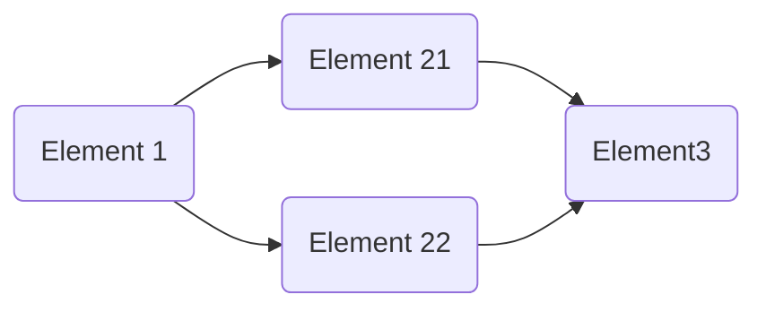

```
title: Data Structure
toc: 2
```

It is possible to define tasks and address them an order.

To do so, it is necessary to define the previous element of note using the list:

```
previous:
 - previous Element1's id
 - previous Element2's id
```

The tool will populate the previous and the next element list in the final document based this order.

## Example

The next note are organized as following



