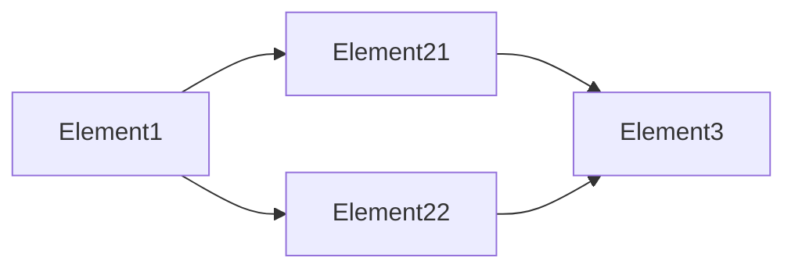

```
title: Data Structure
dashboard: 2
```

The Dashboard is a feature allowing you to organise yours tasks and activity. This is not based on time management neither than priority but simply on requirements. To perform a task the previous one shall be done.

## Previous tasks

So when you define a task you can use the element

```md
​```
previous:
 - a previous task ID
 - another previous task ID
​```
```

The both task shall be done to preform the task containing the `previous` structure.

## Task state

It is possible to define the state of a tasks. Three value are possible : `active`, `done`, `waiting`.

```md
​```
task: active
​```
or
​```
task: done
​```
or
​```
task: waiting
​```
```

By using this element, it is possible to overcome the normal behaviour of the dashboard and provide more control on the task status.

## Dashboard

The dashboard is defined using the element

```md
​```
dashboard:2
​```
```

The number associated to the dashboard provided a behaviour similar to the Table of Content.

The dashboard will show tasks defined on the next two levels.

## Example

The next note show an example of a dash board based on the structure:



